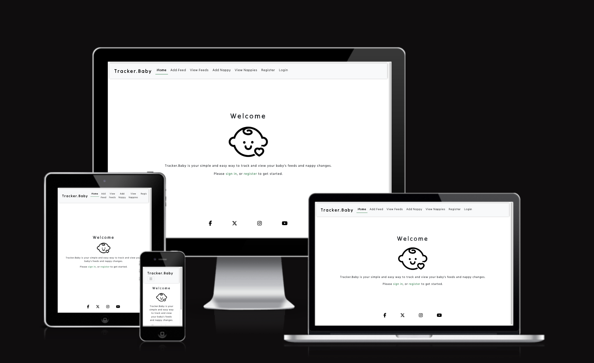
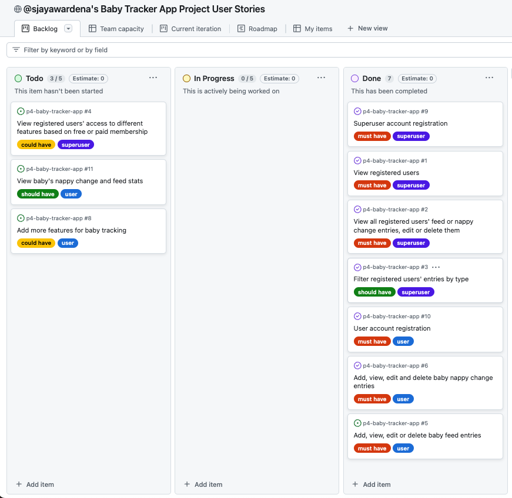

# Tracker.Baby

Welcome! Tracker.Baby is a site for parents to enter details and keep track of their babies's feeds and nappy changes.

It is the fourth project for my Diploma in Full Stack Software Development, and utilises the Django framework linked to a PostgreSQL object-relational database, along with the Bootstrap, Python, HTML, JavaScript and CSS languages.

The site is responsive across all screen sizes.

This is a link to the deployed site:

## User Experience (UX)

### User Demographic

The site is intended for parents of a baby or toddler requiring breast or formula feeds, as well as nappy changes.

### User Stories

Throughout development, this [kanban board](https://github.com/users/sjayawardena/projects/8/views/1) was used to work through user stories in order of priority. User stories' functionality was labelled as relating to either the site superuser, or to standard users. They were also labelled in terms of priority - must have, should have, could have.

The user stories were:

#### Superuser / Must Have (All Completed)

As a superuser I can get my superuser account set up so that carry out admin functions
- Acceptance Criteria (AC) 1: Superuser account set up, the first for account set up for the site
- AC2: Superuser can successfully log in
- AC3: Superuser can see admin dashboard

As a superuser I can view all registered users so that I can see their account information and usage.
- AC1: View list of registered users
- AC2: See date each user joined and date they last logged in
- AC3: Change info regarding their account - such as username, email address etc if requested/necessary

As a superuser I can create, view, edit or delete feed and nappy change entries for all users so that I can be in control of baby tracker app's usage
Acceptance Criteria
AC1: View list of registered users with ability to create, read, update or delete their feed or nappy change entries
AC2: See date each user joined and date they last logged in
AC3: Change info regarding their account - such as username, email address etc if requested/necessary #

#### Superuser / Should Have (Completed)

As a superuser I can search/filter registered users' entries so that I can see how much the app is being used to track certain things - e.g. feeds, nappy changes etc.
- AC1: Option in admin dashboard to filter list of site users' entries by type - e.g. feeds, nappy changes etc
- AC2: Option in admin dashboard to search through entries by type - e.g. feeds, nappy changes etc
- AC3: Option in admin dashboard to see when user's acccount set up

#### User / Must Have (Completed)

As a site user I can register my account so that I can use the Tracker.Baby site
- AC1: Allauth successfully installed
- AC2: New user logins can be created via allauth
- AC3: New user logins work successfully

As a site/registered user I can add, view, edit and delete entries for my baby's nappy changes so that I can keep track of when nappies were changed and the contents of the nappies.
- Enter a nappy change in the app, along with date and time
- Specify wet, dirty, both, or neither
- View all nappy change entries, edit or delete them

As a site/registered user I can add, view, edit and delete entries for my baby's feeds so that I can keep track of when my baby was fed, and what type of feed it was.
- Enter a feed in the app, along with date and time
- Specify formula, breast, and the amount of each
- View all feed entries, edit or delete them

#### Superuser / Could Have (Not Completed)

As a superuser I can view registered users' access to different features based on free or paid membership so that more features can be added for users who pay
- AC1: Site users listed in admin dashboard as either free or paid users
- AC2: Option to filter list of site users in admin dashboard by either free or paid
- AC3: Information visible in admin dashboard about when user signed up to paid, if/when subscription is ending

#### User / Should Have (Not Completed)

As a registered user/site user, I can view weekly or monthly stats about my baby's feeds or nappy changes so that I can identify trends.
- View weekly or monthly nappy change stats - how many nappy changes, how many of a certain type etc
- View weekly or monthly feed stats - how many feeds, how many of a certain type, average amounts
- Easily access the stats through the Home page viewed upon sign in

#### User / Could Have (Not Completed)

As a registered user/site user, I can view weekly or monthly stats about my baby's feeds or nappy changes so that I can identify trends.
- View weekly or monthly nappy change stats - how many nappy changes, how many of a certain type etc
- View weekly or monthly feed stats - how many feeds, how many of a certain type, average amounts
- Easily access the stats through the Home page viewed upon sign in

## Design

### Colour Scheme

### Fonts

## Wireframes

## Features

### Existing Features

## Deployment

## Technologies Used

- HTML5 - to code for each page.
- CSS - to style each page.
- JavaScript - to program all elements of how the quiz functions and moves through screens.
- [GitHub](https://github.com/) - to create and store the repository for the website.
- [GitPod](https://www.gitpod.io/) - the Integrated Development Environment (IDE) used to build the site, and to 'git commit' and 'git push' back to the GitHub repository.
- [Balsamiq](https://balsamiq.com/wireframes/) - Application used on Mac to create wireframes.
- [Google Fonts](https://fonts.google.com/) - both fonts used in this project were chosen via Google Fonts and linked to at the top of the 'style.css' file.
- [icons8 website](https://icons8.com/) - the favicons were downloaded from here.
- [Color Space website](https://mycolor.space) - used to select colour scheme.
- [Pixabay website](https://pixabay.com/) - royalty-free flag images vector art images were downloaded from here for use during the quiz, as well as the start and end screen globe-of-flags hero image.
- [Chrome DevTools](https://developer.chrome.com/docs/devtools/) - used to inspect the website and its performance at every step of development.
- [Lighthouse](https://developer.chrome.com/docs/lighthouse/overview/) - used to assess the overall quality of the site.
- [W3C Markup Validation site](https://validator.w3.org/) - used to find issues in the html for the site and to resolve them 
- [W3C CSS Validation site](https://jigsaw.w3.org/css-validator/) - used to find issues in the CSS for the site and to resolve them.
- [JS Hint validation site](https://jshint.com/) - used to find issues in the JavaScript for the site and to resolve them.
- [Am I Responsive? site](https://ui.dev/amiresponsive) - used to generate screenshots of the site across different devices and screen sizes.

## Testing

The website was tested on the Chrome, Safari and Firefox browsers. On each browser, it was inspected in mobile view (including iPhone SE and Galaxy Fold), and then the screen size increased all the way up to full screen desktop view.

On each browser, in all display sizes/modes, all of the following have been tested and confirmed as working:

Problems encountered in testing phases - both at the end of the process and at various stages during the process - include:

### Validator Testing

The site's script.js JavaScript files passed through [JS Hint](https://jshint.com/) validator service successfully. 

The site's base.css file has passed through the [W3C validation](https://validator.w3.org/) process.

The html for the site has also passed through the [W3 validation](https://validator.w3.org/) process.

All screens - intro, game and end - on the site have all scored adequately on the report generated by Lighthouse.

### Unfixed Bugs

There are no unfixed bugs that I am aware of.

## Credits

### Content

### Code

### Media

