# Tracker.Baby

Welcome! Tracker.Baby is a site for parents to enter details and keep track of their babies's feeds and nappy changes.

It is the fourth project for my Diploma in Full Stack Software Development, and utilises the Django framework linked to a PostgreSQL object-relational database, along with the Bootstrap, Python, HTML, JavaScript and CSS.

The site has full CRUD functionality whereby users can create, read, update and delete database entries via the Feed and NappyChange models.

Users are required to create an account and sign in with a username and password, after also entering their email address.

The site is responsive across all screen sizes.

This is a link to the deployed site:

## User Experience (UX)

### User Demographic

The site is intended for parents of a baby or toddler requiring breast or formula feeds, as well as nappy changes.

### User Stories - Implemented

Throughout development, this [kanban board](https://github.com/users/sjayawardena/projects/8/views/1) was used to work through user stories in order of priority. User stories' functionality was labelled as relating to either the site superuser, or to standard users. They were also labelled in terms of priority - must have, should have, could have.

The user stories were:

#### Superuser / Must Have (Completed)

**As a superuser I can get my superuser account set up so that carry out admin functions**
- Acceptance Criteria (AC) 1: Superuser account set up, the first for account set up for the site
- AC2: Superuser can successfully log in
- AC3: Superuser can see admin dashboard

**As a superuser I can view all registered users so that I can see their account information and usage.**
- AC1: View list of registered users
- AC2: See date each user joined and date they last logged in
- AC3: Change info regarding their account - such as username, email address etc if requested/necessary

**As a superuser I can create, view, edit or delete feed and nappy change entries for all users so that I can be in control of baby tracker app's usage**
Acceptance Criteria
- AC1: View list of registered users with ability to create, read, update or delete their feed or nappy change entries
- AC2: See date each user joined and date they last logged in
- AC3: Change info regarding their account - such as username, email address etc if requested/necessary #

#### Superuser / Should Have (Completed)

**As a superuser I can search/filter registered users' entries so that I can see how much the app is being used to track certain things - e.g. feeds, nappy changes etc.**
- AC1: Option in admin dashboard to filter list of site users' entries by type - e.g. feeds, nappy changes etc
- AC2: Option in admin dashboard to search through entries by type - e.g. feeds, nappy changes etc
- AC3: Option in admin dashboard to see when user's account set up

#### User / Must Have (Completed)

**As a site user I can register my account so that I can use the Tracker.Baby site**
- AC1: Allauth successfully installed
- AC2: New user logins can be created via allauth
- AC3: New user logins work successfully

**As a site/registered user I can add, view, edit and delete entries for my baby's nappy changes so that I can keep track of when nappies were changed and the contents of the nappies.**
- AC1: Enter a nappy change in the app, along with date and time
- AC2: Specify wet, dirty, both, or neither
- AC3: View all nappy change entries, edit or delete them

**As a site/registered user I can add, view, edit and delete entries for my baby's feeds so that I can keep track of when my baby was fed, and what type of feed it was.**
- AC1: Enter a feed in the app, along with date and time
- AC2: Specify formula, breast, and the amount of each
- AC3: View all feed entries, edit or delete them

### User Stories - Not Implemented / For Future Implementations

#### Superuser / Could Have (Not Completed)

**As a superuser I can view registered users' access to different features based on free or paid membership so that more features can be added for users who pay**
- AC1: Site users listed in admin dashboard as either free or paid users
- AC2: Option to filter list of site users in admin dashboard by either free or paid
- AC3: Information visible in admin dashboard about when user signed up to paid, if/when subscription is ending

#### User / Should Have (Not Completed)

**As a registered user/site user, I can view weekly or monthly stats about my baby's feeds or nappy changes so that I can identify trends.**
- AC1: View weekly or monthly nappy change stats - how many nappy changes, how many of a certain type etc
- AC2: View weekly or monthly feed stats - how many feeds, how many of a certain type, average amounts
- AC3: Easily access the stats through the Home page viewed upon sign in

#### User / Could Have (Not Completed)

**As a registered user/site user, I can view weekly or monthly stats about my baby's feeds or nappy changes so that I can identify trends.**
- AC1: View weekly or monthly nappy change stats - how many nappy changes, how many of a certain type etc
- AC2: View weekly or monthly feed stats - how many feeds, how many of a certain type, average amounts
- AC3: Easily access the stats through the Home page viewed upon sign in

## Database Entity Relationship Diagram

This Entity Relationship Diagram (ERD) details the models used for the site. Django's built-in User model was used, along with the custom-created Feed and Nappy Change models.

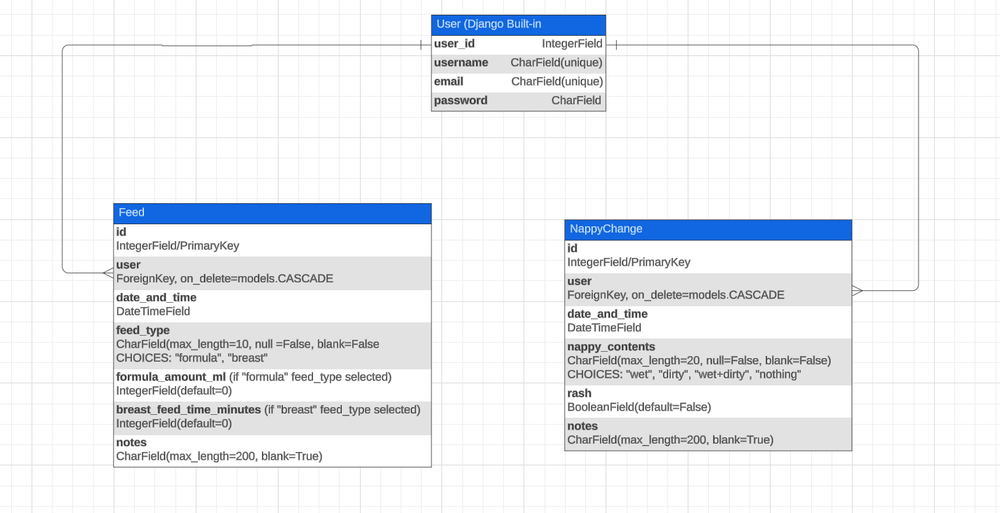

## Design

The site design is simple and minimal, with an emphasis on short and concise bits of information in the form of users' nappy and feed entries.

### Colour Scheme

Three colours are used on the site to help facilitate this minimalism - the white of the background (#FFFFFF,), the black of the text and any images (#000000), and the green used for buttons on the site, active navbar section underlines and any text with a hyperlink (#198754). Green was also picked as it is gender-neutral, so does not seem geared towards either boy or girl babies.

### Fonts

To further enhance the site's minimal style, two clean-looking sans-serif Google fonts are used - Tilt Neon for page titles, the header logo and navbar text, and Hind for everything else.

 

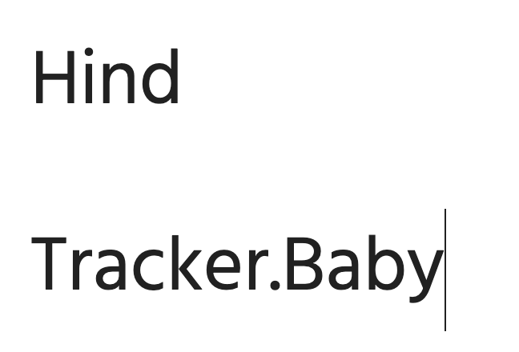

## Wireframes

Wireframes were used in the planning stage of the project to flesh out how the site should look across its different pages for both mobile and desktop.

Shown here are wireframes for the home page/dashboard, the add/edit feed and add/edit nappy change pages, the view feeds and view nappy changes pages, and the detail view for individual feed or nappy change entries.

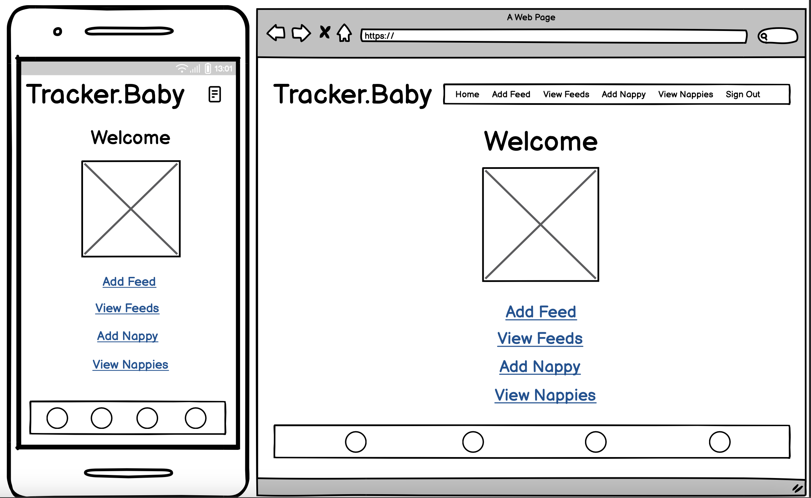

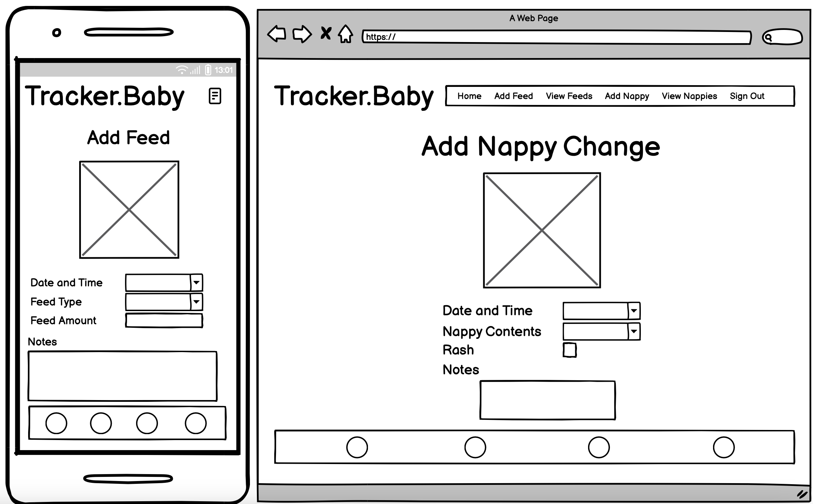

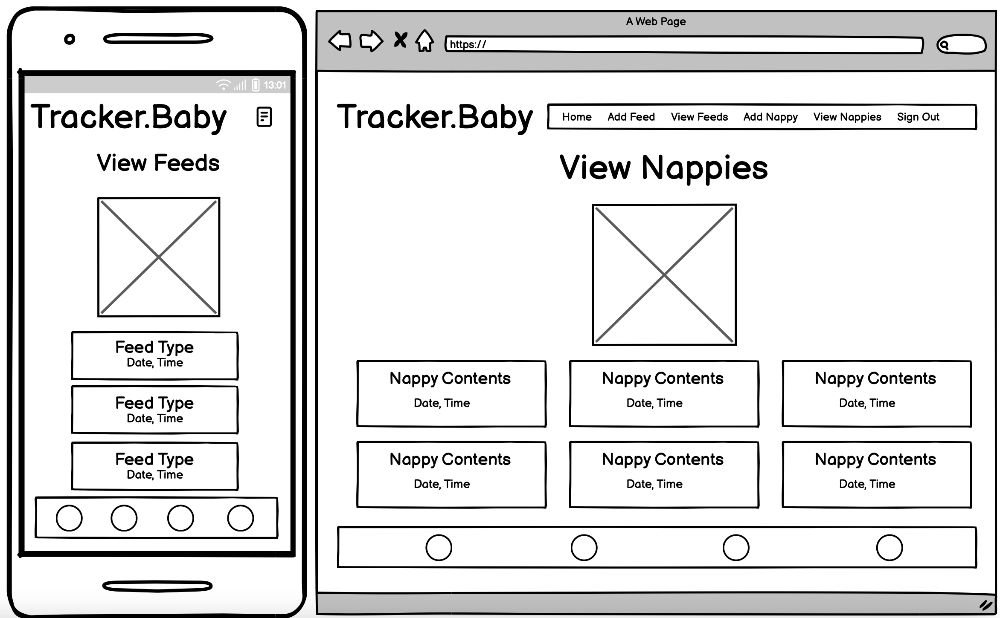

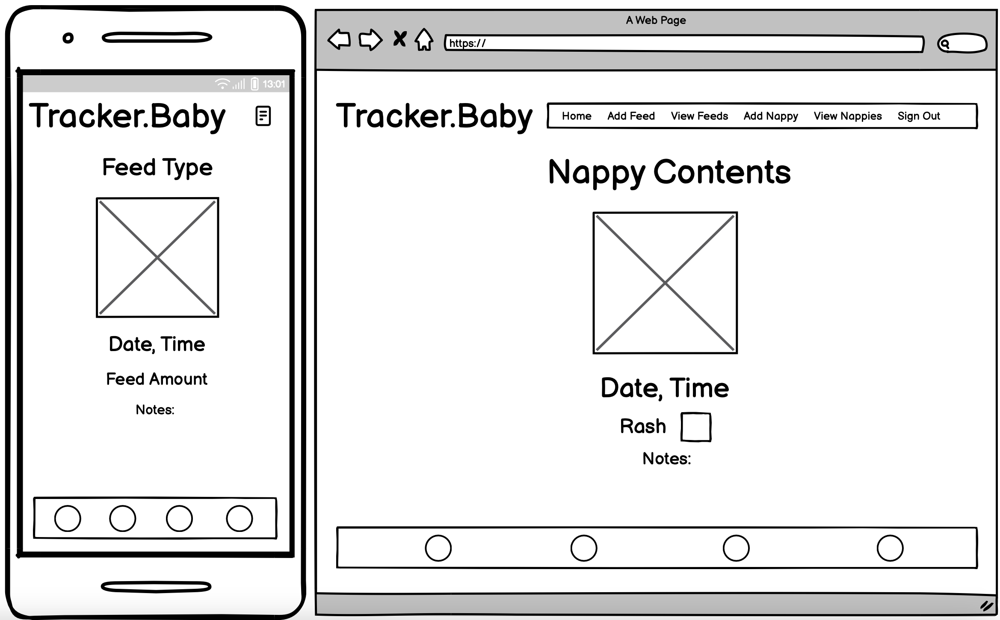

## Features

### Existing Features

All features are shown here in mobile view.

#### Header/Navbar

This has the site's text logo, which also works as a link back to the home page/dashboard. Also it has links to all pages of the site, which dropdown in collapsable menu form on mobile. If the user is signed in, they will see "Sign Out" as the last option. If not, they will see "Login" and "Register" as the last options.

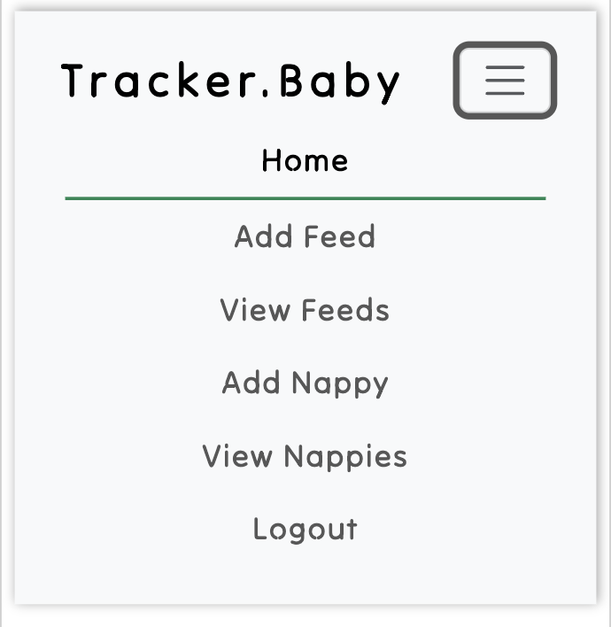

#### Homepage/Dashboard

If the user is logged in, the Home page functions as a dashboard where the user can click on four different hyperlinks - Add Feed, View Feeds, Add Nappy, View Nappies - that take them through to different functions and parts of the site.

If the user is not logged in, the Home page explains what the site is for, and prompts them to register or sign in.

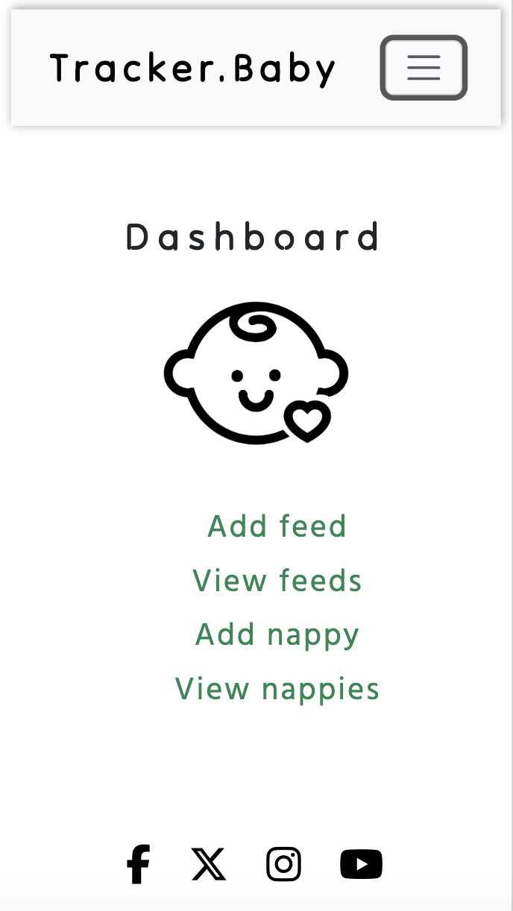

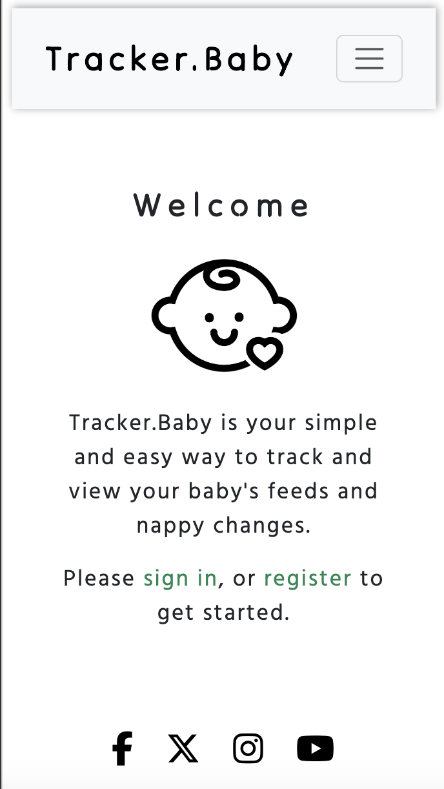

A clipart picture of a baby's head with a heart next to it is used in both cases.

#### Login/Sign In Page

The Login/Sign In page allows users to enter their username and password to log in. It is linked to from the home page, the navbar, and also appears if users who are not signed in or registered attempt to access any of the site's features via the navbar.

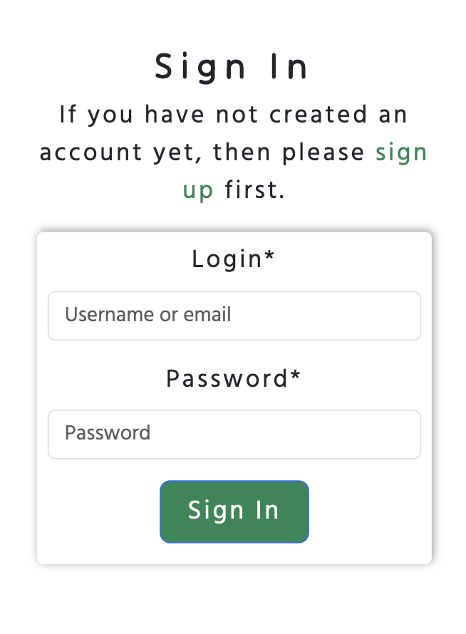

#### Register / Sign Up Page

This can be reached via links on the home page, the navbar if the user is not signed in or registered, and from a link on the Login/Sign In page. Here users enter their email address, and create a username and password in order to register their account.

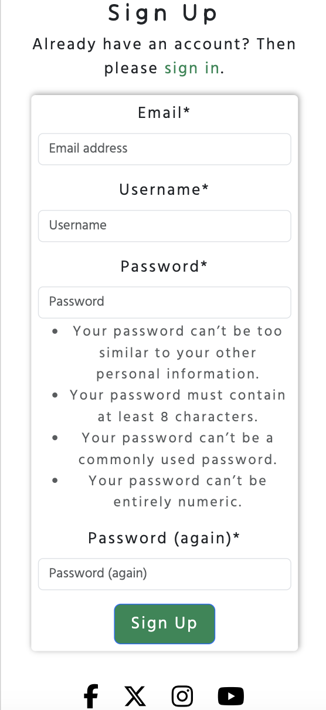

#### Sign Out Page

The Sign Out page is reached once the user clicks Logout in the navbar. Users are asked to confirm they wish to sign out.

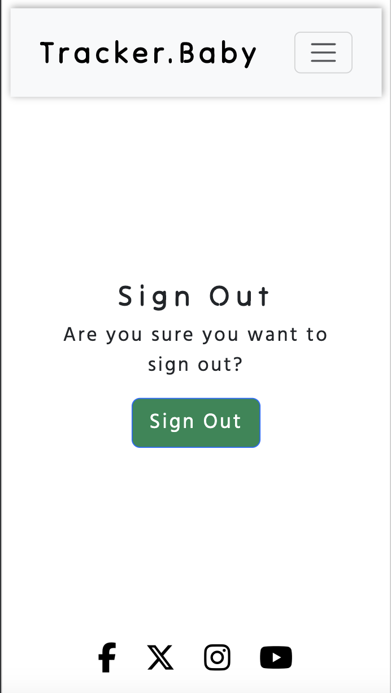

#### Add Feed Page

Here the user can add a feed entry for their baby. They select the time and date, the type of feed (either formula or breast), the amount of the feed, and can input any optional notes. If the user selects a formula feed, an input box appears called Formula Amount (ml), whereas if they select breast then an input box appears called Breast Feed Duration (Minutes). 

Once the green Enter Feed button is hit, the user is redirected to the View Feeds page, with their latest entry at the top.

A clipart picture of a baby bottle is used to represent feeding in general.

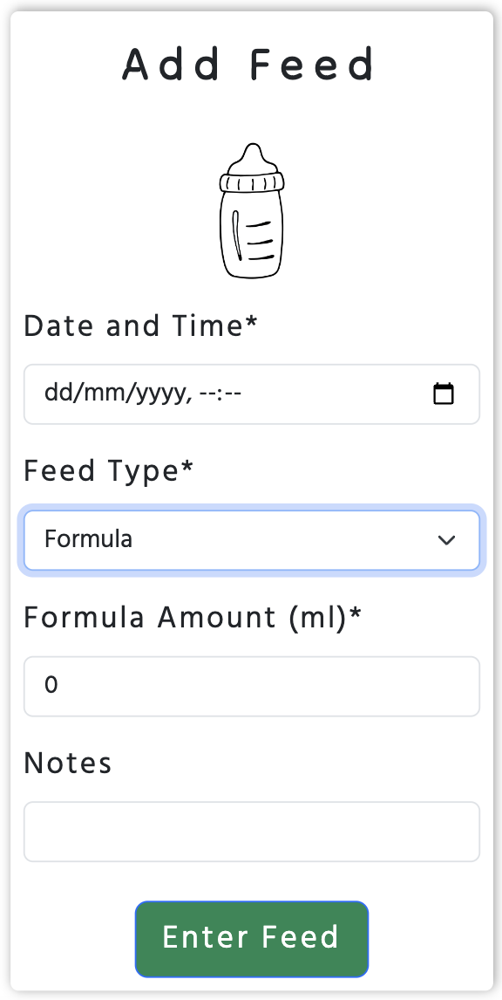

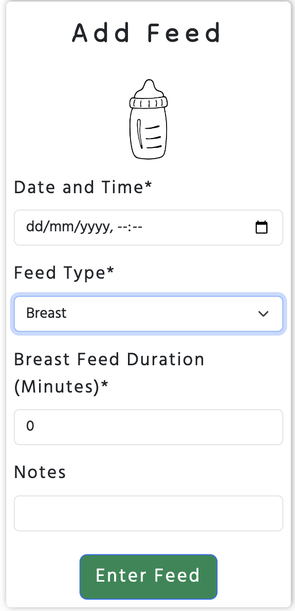

#### View Feeds Page

The View Feeds page shows the user all their previous feeds as Bootstrap cards with the feed type and date/time on them. A prompt at the top makes clear the feeds can be clicked on and expanded into detail view from where they can be edited or deleted. 

The grid is responsive from a single vertical column on mobile, to three columns on a desktop screen. It is ordered by time and date with the most recent feed first.

A clipart picture of a baby bottle is used to represent feeding in general.

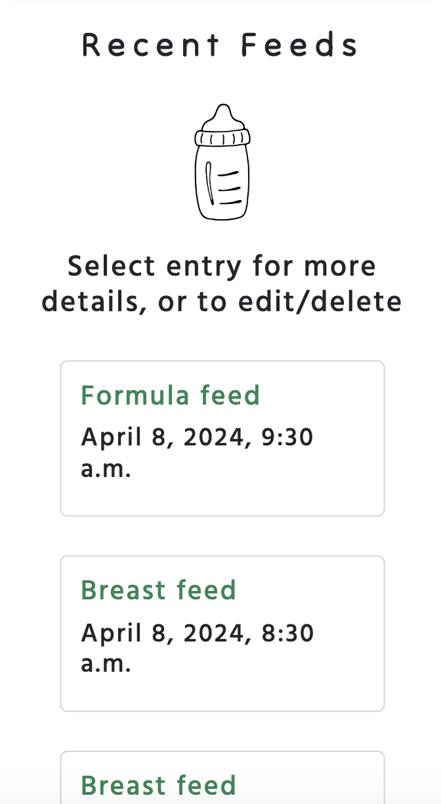

#### Add Nappy Change Page

Here the user can add a nappy change entry for their baby. They select the time and date, the contents of the nappy (wet, dirty, wet+dirty or nothing), tick the rash box if applicable, and can input any optional notes.

Once the green Enter Nappy Change button is hit, the user is redirected to the View Feeds page, with their latest entry at the top.

A clipart picture of a baby in a nappy is used at the top.

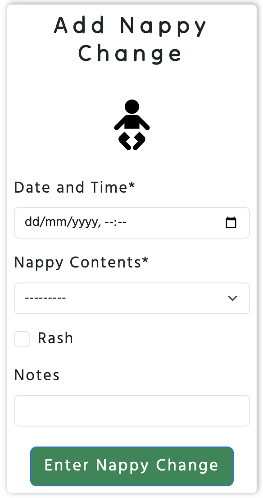

#### View Nappies Page

The View Nappies page shows the user all their previous feeds as Bootstrap cards with the feed type and date/time on them. A prompt at the top makes clear the nappy changes can be clicked on and expanded into detail view from where they can be edited or deleted. 

The nappies grid is responsive from a single vertical column on mobile, to three columns on a desktop screen.

It is ordered by time and date with the most recent nappy change first.

A clipart picture of a baby in a nappy is used.

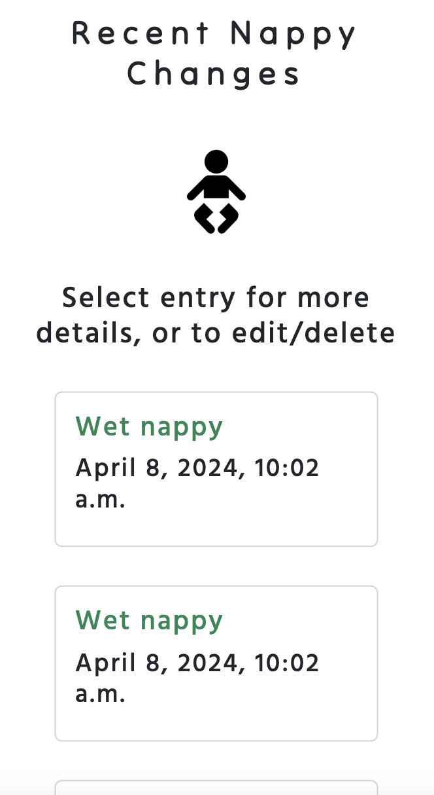

#### Feed Detail Page

Clicking on a feed entry from the View Feeds page brings that feed up in the detail view. Here information from all fields are shown - feed type, date and time, a Formula Amount (ml) field or a Breast Feed Duration (Minutes) field as applicable, and notes. 

A clipart picture is shown at the top based on whether the feed is formula or breast. If it's formula, the same image of a baby milk bottle from previous screens is shown. If breast a clipart image of a woman breastfeeding is shown.

There are green buttons at the bottom that the user can hit to either Edit or Delete the feed.

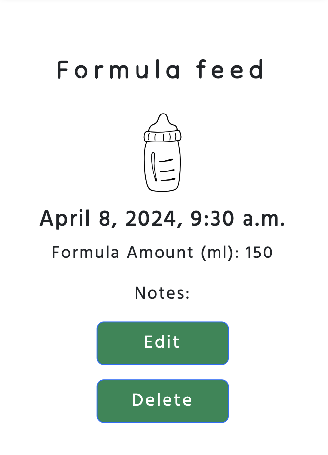

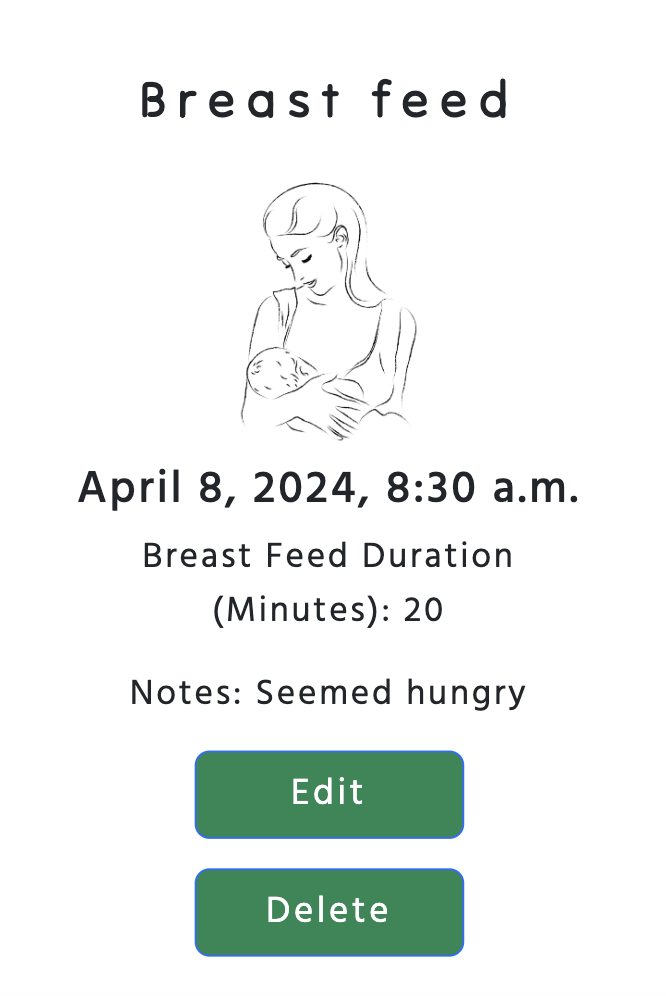

#### Edit Feed Page

If a user selects to edit a feed from the feed detail view, then all applicable fields are presented again as editable - feed type, date and time, a Formula Amount (ml) field or a Breast Feed Duration (Minutes) field as applicable, and notes. Once they are happy with their edits, or lack of edits, they can hit the green Confirm Changes button and they will be taken back to the View Feeds page.

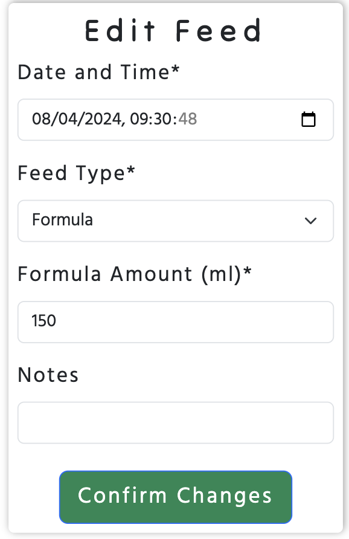

#### Confirm Delete Feed Page

If a user selects to delete a feed from the feed detail view, they get this screen asking them if they are sure. Hitting the green button confirms the deletion, or the Tracker.Baby logo or anything in the navbar can be clicked to take them away from this screen and cancel the deletion.

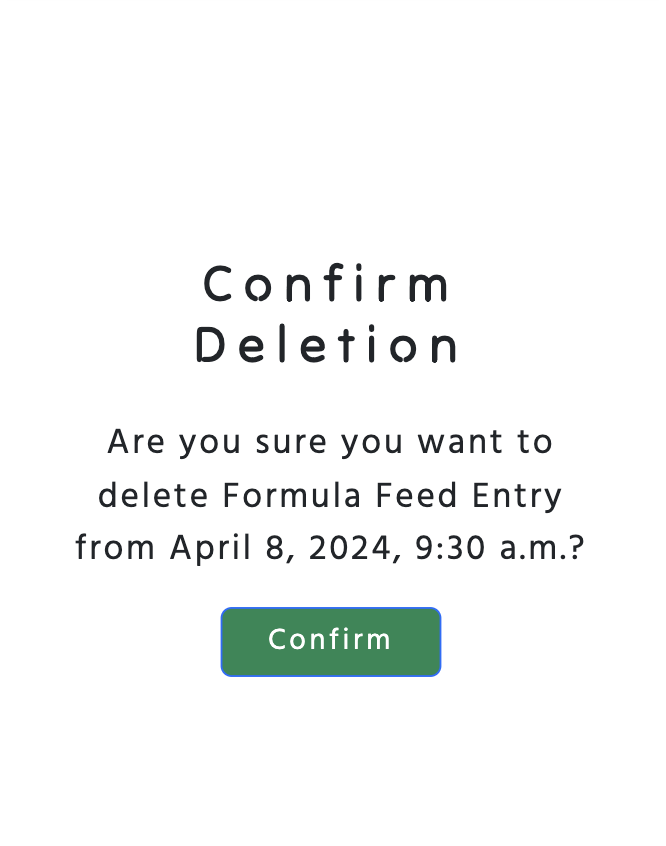

#### Nappy Change Detail Page

Clicking on a nappy change entry from the View Nappies page brings that nappy change up in the detail view. Here information from all fields are shown - nappy contents, date and time, a checkable rash box, and notes. 

A clipart picture is shown at the top to illustrate somebody changing a baby's nappy. 

There are green buttons at the bottom that the user can hit to either Edit or Delete the nappy change.

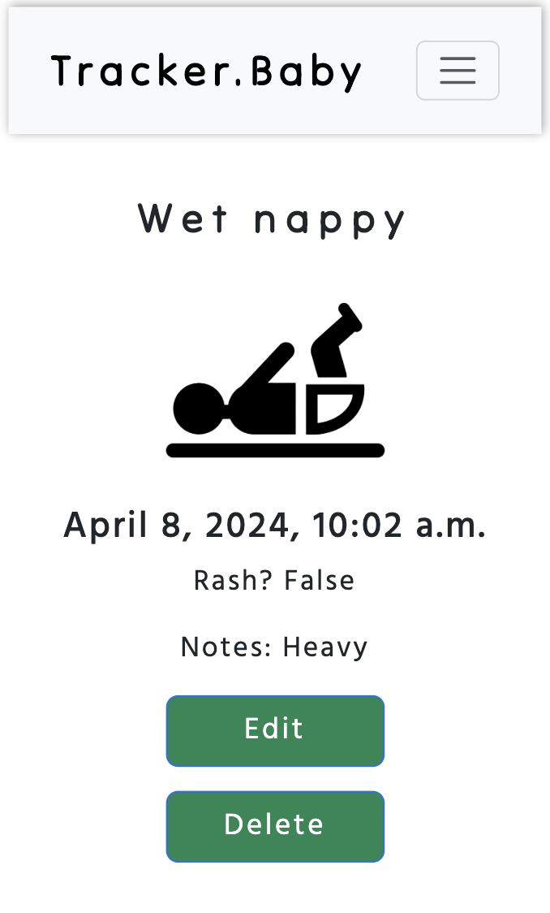

#### Edit Nappy Change Page

If a user selects to edit a nappy change from the nappy change detail view, then all applicable fields are presented again as editable - nappy contents, date and time, a checkable rash box, and notes. Once they are happy with their edits, or lack of edits, they can hit the green Confirm Changes button and they will be taken back to the View Nappies page.

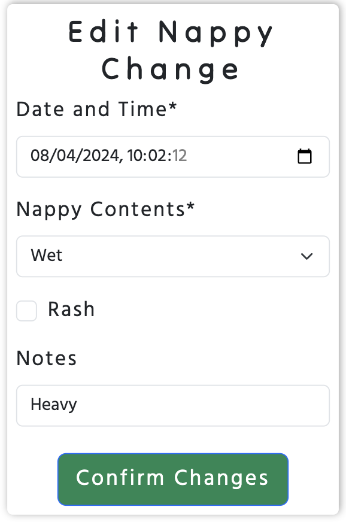

#### Confirm Delete Nappy Change Page

If a user selects to delete a nappy change from the nappy change detail view, they get this screen asking them if they are sure. Hitting the green button confirms the deletion, or the Tracker.Baby logo or anything in the navbar can be clicked to take them away from this screen and cancel the deletion.

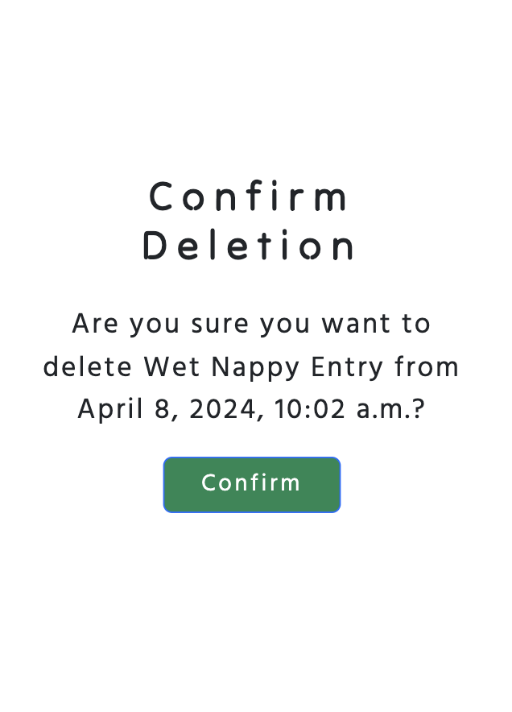

#### 403 Unauthorized Access Page

This page is in place to stop users taking actions they are not authorized to. For instance deleting or editing another user's feed or nappy change entries via copying-and-pasting the link to their own edit or delete entry page, and swapping in a different primary key number.

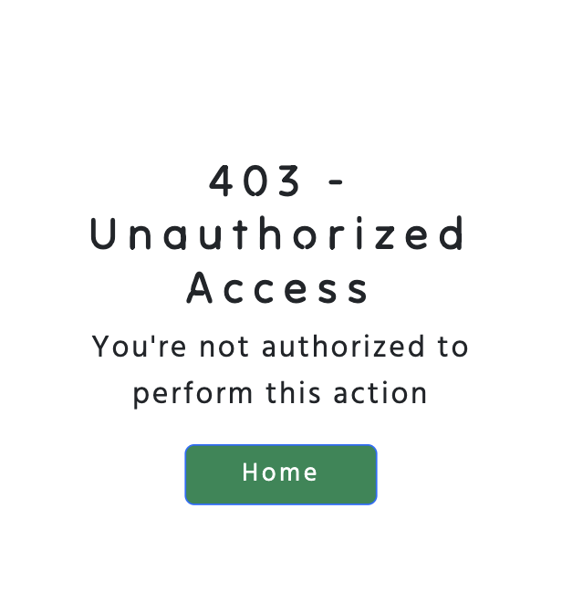

#### Footer

The page footer has clickable social media icons that link through to their respective platforms.

#### Admin / Superuser Dashboard

The admin/superuser dashboard, shown here in desktop view, allows the superuser to see details of all users, and all users' posts. The superuser can filter by posts by type, form fields, and user. It also allows the superuser full CRUD functionality over all users' posts.

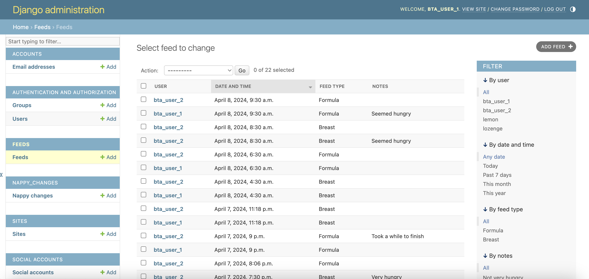

## Testing

The website was tested on the Chrome, Safari and Firefox browsers. On each browser, it was inspected in mobile view (including iPhone SE and Galaxy Fold), and then the screen size increased all the way up to full screen desktop view.

On each browser, in all display sizes/modes, all of the following have been tested and confirmed as working:
- All links in the header navbar work as expected, including the text logo, taking the user through to the expected page. If the user is not signed in or registered, they are prompted to sign in or register if they try to click on anything other than Home. In this case, there are also Login and Register options on the navbar. If the user is signed in, then these are replaced with a Logout option on the navbar.
- The Home page displays a sentence explaining what the site is if the user is signed out, along with links to the Register or Login/Sign In pages. If the user is signed in, it displays a Dashboard, with links through to all areas of the site - Add Feed, View Feeds, Add Nappy Change, View Nappy changes. All these links have been tested and work as expected.
- The Login/Sign In page functions as expected. Users can enter their email address or username, along with their password, and they are successfully signed in.
- The Register/Sign Up page allows users to enter their email address, a username, select a password (twice), and then hit the Sign Up button, and their accounts are successfully created. The user is then taken through to their home dashboard, indicating they are now an authenticated user.
- The Sign Out page appears after users hit Logout in the navbar, and asks users to confirm they want to sign out. Once confirmed via hitting the green button, users are taken back to the non-signed in version of the Home page.
- All parts of the Add Feed page work as expected. The date and time can be selected via the dropdown menu, feed type can be selected via the dropdown menu, a Formula Amount (ml) input with a default of 0 appears if the user selects the "formula" feed type, a Breast Feed Duration (Minutes) input with a default of 0 appears if the user selects the "breast" feed type, and the Notes field takes input on an optional basis. Clicking the green Enter Feed button confirms the entry and takes the user to the View Feeds page, complete with the new entry in the list.
- The View Feeds page displays as expected. Feed entries are displayed in date order with the newest first. The feeds are shown as Bootstrap cards, with the feed type field and the date and time field. The feed type displayed for each entry is a clickable link that opens that feed's detail view.
- All parts of the Add Nappy Change page work as expected. The date and time can be selected via the dropdown menu; nappy contents can be selected via the dropdown menu with the options Wet, Dirty, Wet+Dirty or Nothing all available; and the Notes field takes input on an optional basis. Clicking the green Enter Nappy Change button confirms the entry and takes the user to the View Nappies page, complete with the new entry in the list.
- The View Nappies page displays as expected. Nappy entries are displayed in date order with the newest first. The nappy entries are shown as Bootstrap cards, with the nappy contents field and the date and time field. The nappy contents displayed for each entry is a clickable link that opens that nappy's detail view.
- The feed detail view displays as expected. The image and page title shown is based on whether the feed is formula or breast, as is the feed amount field (Formula Amount ml or Breast Feed Duration Minutes). The date/time and notes fields display correctly. The Edit and Delete buttons click through to the relevant screens.
- The nappy change detail view displays as expected. The image works, and the page title shown is based on whether the nappy contents is Wet, Dirty, Wet+Dirty, or Nothing. The date/time, rash and notes fields display correctly. The Edit and Delete buttons click through to the relevant screens.
- The Edit Nappy Change page displays all fields as fully re-editable, and clicking the green Confirm Changes button updates the entry and brings the user back to the View Nappies page.
- The Delete Nappy Change page asks the user if they are sure they wish to delete the entry, and if they click the green Confirm button, the entry deletes and the user is taken back to the View Nappies page, which no longer displays the deleted entry.
- The Edit Feed page displays all fields as fully re-editable, and clicking the green Confirm Changes button updates the entry and brings the user back to the View Feeds page.
- The Delete Feed page asks the user if they are sure they wish to delete the entry, and if they click the green Confirm button, the entry deletes and the user is taken back to the View Feed page, which no longer displays the deleted entry. 
- The 403 Unauthorized Access page is shown if the user tries to access another user's entry for editing or deleting purposes, most likely by swapping in a different primary key number in the web address. Clicking on the green Home button at the bottom takes the user back to their home dashboard view.  
- All the social media icon links in the page footer take the user, in a new tab, through to their respective platforms.

## Problems Encountered

Problems encountered during development and in the testing phases - both at the end of the process and at various stages during the process - include:
- At first when trying to link to a PostgreSQL database, I had put the full link to the database in settings.py, rather than just the DATABASE_URL variable (with the full link in the hidden env.py file, and in Heroku's config vars). This was a security risk, and also it just did not work, and CRUD functions would not work.
- The first deployment to Heroku did not work, and an H14 error code message was showing. This was solved after contacting Code Institute's Tutor Support, who advised me to log into Heroku via Gitpod's CLI, and run the command "heroku ps:scale web=1".
- When coding the DeleteNappyChange view, the success_url was not working and was defaulting to a lower-case version of the model name. So, on advice from Tutor Support, I imported the reverse_lazy package and used that in the view to redirect to the desired page - "feeds_list". This was also the case for the EditNappyChange view, and was solved in the same way.
- When trying to code for the conditional inputs on the Add Feed form (Formula Amount ml for formula, Breast Feed Duration Minutes for breast), the JavaScript file (add_feed.js) that I had linked to as a  at the bottom of add_feed.html was not having an effect. This was solved by adding a blank  tag to the bottom of the site base.html file.
- On the Heroku deployment, all images on the site were working apart from those in the nappies pages - Add Nappy and View Nappies. This turned out to be because the img elements'  src attribute links had a trailing slash on the end of them. Removing these and redeploying solved the problem.

## Validator Testing

### HTML

The html files for the site across all apps have successfully passed through the [W3 validation](https://validator.w3.org/) process.

The boilerplate text, html and head elements from the top of base.html in the 'templates' folder of the root directory passed through with no issues.

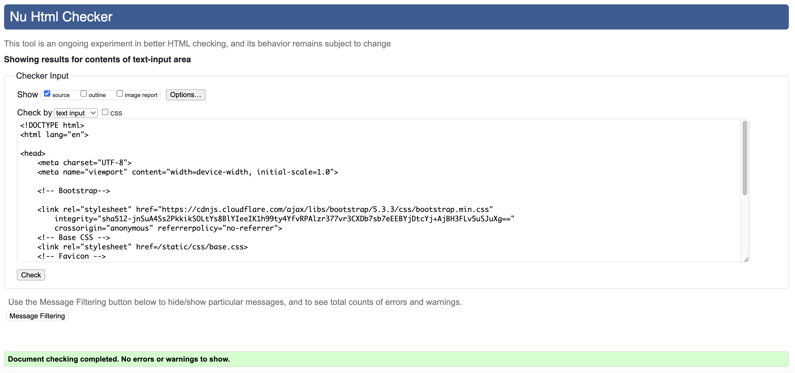

Then, the contents of all of these html files passed through the validator with no issues (the issues flagged warning that there was no boilerplate html at the top - DOCTYPE, head element, html element, title element etc - were ignored due the the templated nature of the files, and on the basis that the boilerplate text, html and head elements of base.html passed through with no issues):

- footer.html (root directory, in 'templates/includes' folder)
- header.html (broot directory, in 'templates/includes' folder)
- 403.html (root directory, in 'templates' folder)
- add_feed.html (feeds app)
- edit_feed.html (feeds app)
- feed_confirm_delete.html (feeds app)
- feed_detail.html (feeds app) (the issue flagged about the empty src and alt attributes for the first image element were ignored because the html validator cannot take account of the templated if statements)
- feeds_list.html (feeds app) (the issue about a possible misuse of aria-labels for each card was ignored, because I preferred to include them. The aria labels use templating to state the title of each feed entry card - i.e. the feed type and the date)
- index.html (home app, authenticated and non-authenticated version) (the issue about an a element not being allowed as a child of a ul element was ignored as I needed to have links in this list)
- add_nappy_change.html (nappy_changes app)
- edit_nappy_change.html (nappy_changes app)
- nappy_change_confirm_delete.html (nappy_changes app)
- nappy_change_detail.html (nappy_changes_app)
- nappy_changes_list.html (nappy_changes app) (the issue about a possible misuse of aria-labels for each card was ignored, because I preferred to include them. The aria labels use templating to state the title of each feed entry card - i.e. the feed type and the date)

### Python

The site's Python files across all apps have successfully passed through [Code Institute's PEP8 validator tool](https://pep8ci.herokuapp.com/).

These files are:

- settings.py (baby_tracker_app app)(the issues regarding 4 lines being too long relate to Django-supplied code, so were ignored)

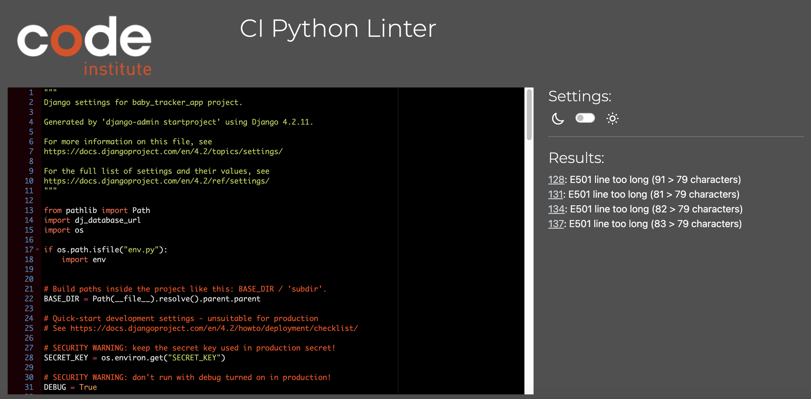

- urls.py (baby_tracker_app app)
- admin.py (feeds app)
- forms.py (feeds app)
- models.py (feeds app)
- urls.py (feeds app)
- views.py (feeds app)
- urls.py (home app)
- views.py (home app)
- admin.py (nappy_changes app)
- forms.py (nappy_changes app)
- models.py (nappy_changes app)
- urls.py (nappy_changes app)
- views.py (nappy_changes app)
- manage.py (root directory)

### JavaScript

The site's minimal JavaScript files passed through [JS Hint](https://jshint.com/) validator service successfully. These files are: 

- add_feed.js in the 'static/js' file in the root directory

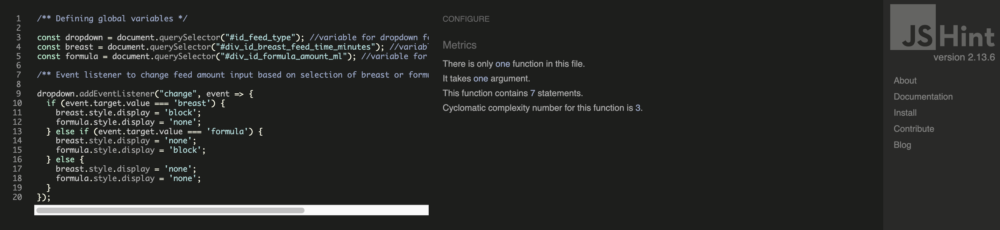

- edit_feed.js in the 'static/js' file in the root directory

### CSS

The contents of the site's base.css file in the 'static/css' folder of the root directory have passed through the [W3C validation](https://validator.w3.org/) process.

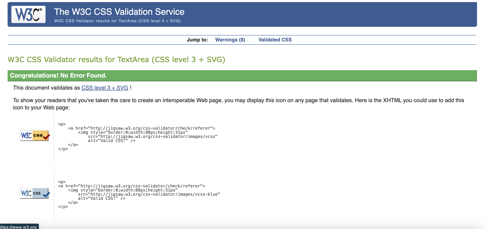

All screens on the site have all scored adequately on the report generated by Lighthouse.

### Site Performance - Lighthouse

All pages on the site have passed through and scored adequately on the Lighthouse performance validator.

These pages are:

- Home page

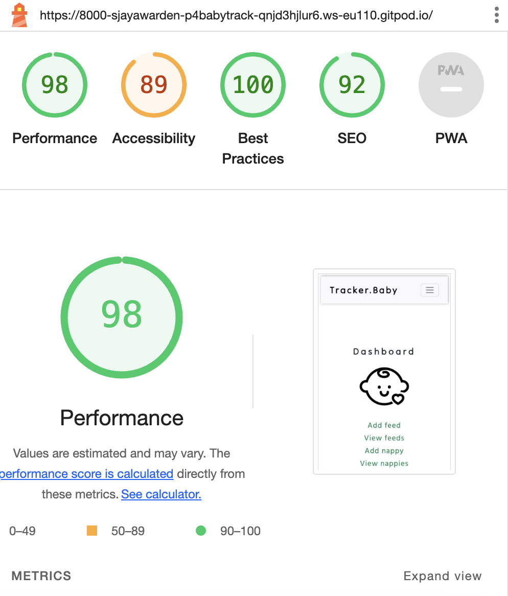 

- Add Feed page
- View Feeds page
- Edit Feeds page
- Delete Feeds page
- Feed Detail page
- Add Nappy Change page
- View Nappies page
- Edit Nappy Change page
- Delete Nappy Change page
- Nappy Change Detail page
- Sign In, Register and Sign Out pages

## Development and Deployment

The site was set up by creating a new repository on GitHub, using a template from CodeInstitute.

The development environment used was Gitpod. This was opened initially via the 'Gitpod' button that appeared on the repo's listing on GitHub.

The initial 'git add', 'git commit' and 'git push' were made on 24 March 2024. There have been over 60 further commits since then.

The regular commits and pushes were sent from Gitpod back to the repo on GitHub.

The Django framework was firstly installed to the Gitpod IDE.

During the course of development, these other packages, frameworks and libraries were also installed to the IDE:
- Black
- django-crispy-forms
- Crispy Bootstrap5
- psycopg2
- django-allauth
- gunicorn
- dj_database_url
- whitenoise

Bootstrap was added to the IDE via CDN.

Code Institute's PostgreSQL database tool was linked to via a database url in the env.py file (which itself was added to gitignore).

To deploy the site to Heroku, the following steps from Code Institute course content were followed (but with project/app names adapted as needed):

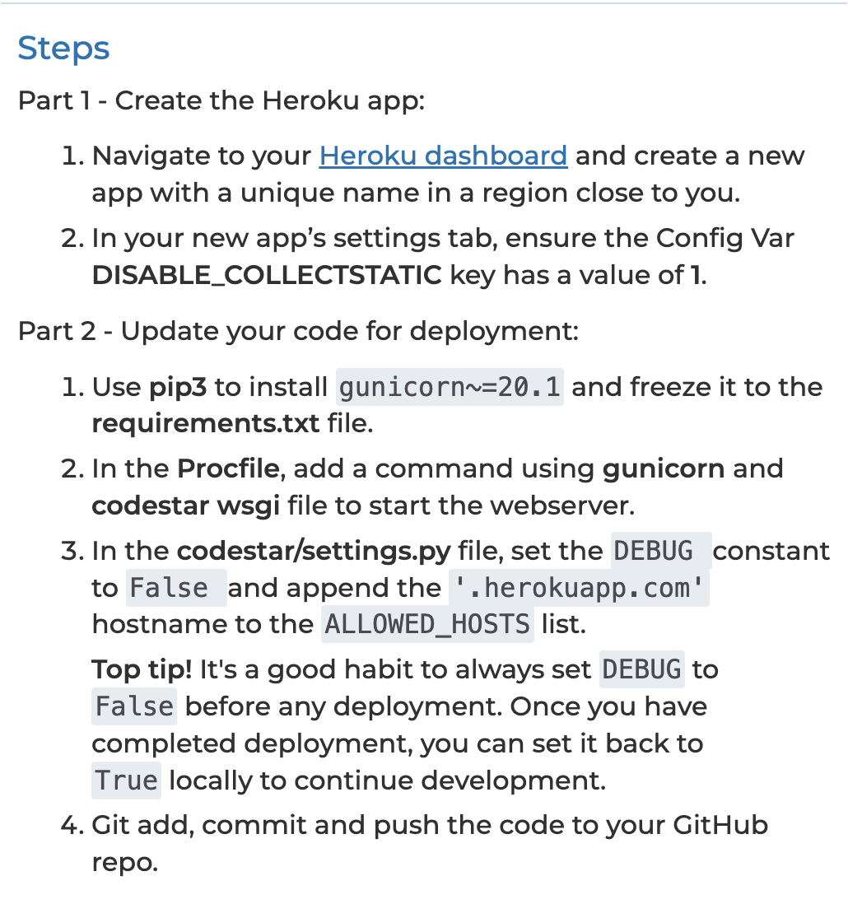
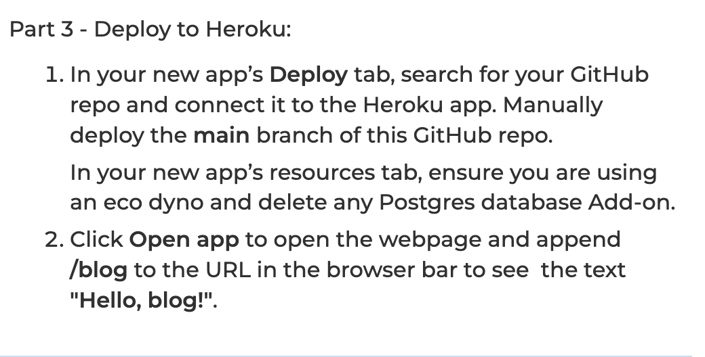

The site was then redeployed at different stages of development.

## Technologies Used

- [Django](https://www.djangoproject.com/) - framework used to build the site
- [Bootstrap](https://getbootstrap.com/) - framework used to style the site, including mobile-first layout responsiveness.
- HTML5 - to code for all page templates.
- CSS - to add styling on top of Bootstrap.
- Python - used to code across all Django apps and files.
- JavaScript - used very minimally to dynamically alter the Add Feed and Edit Feed forms.
- [PostgreSQL database via Code Institute tool](https://dbs.ci-dbs.net/)
- [GitHub](https://github.com/) - to create and store the repository for the website.
- [GitPod](https://www.gitpod.io/) - the Integrated Development Environment (IDE) used to build the site, and to 'git commit' and 'git push' back to the GitHub repository.
- [Heroku](https://www.heroku.com) - platform used to deploy the site
- [Black Python code formatter](https://black.readthedocs.io/en/stable/) - installed into the IDE to format Python code.
- [django-crispy-forms](https://django-crispy-forms.readthedocs.io/en/latest/) - installed into the IDE to add ready-made styling and structure to forms.
- [psycopg2](https://pypi.org/project/psycopg2/) - postgreSQL database adapter for Python.
- [django-allauth](https://docs.allauth.org/en/latest/) - packaged installed to allow user accounts to be set up and authenticated.
- [dj_database_url](https://pypi.org/project/dj-database-url/) - Django utility to utilise DATABASE_URL variable
- [WhiteNoise](https://whitenoise.readthedocs.io/en/stable/django.html) - Django utility to aid with the use of static files.
- [Balsamiq](https://balsamiq.com/wireframes/) - Application used on Mac to create wireframes.
- [Google Fonts](https://fonts.google.com/) - both fonts used in this project were chosen via Google Fonts
- [Fontawesome](https://fontawesome.com/) - social media link icons came from here.
- [Pixabay website](https://pixabay.com/) - nappy change and feed clipart images came from here.
- [SVG Repo website](https://www.svgrepo.com/) - the main clipart image of the baby's head on the Home page came from here.
- [Chrome DevTools](https://developer.chrome.com/docs/devtools/) - used to inspect the website and its performance at every step of development.
- [Lighthouse](https://developer.chrome.com/docs/lighthouse/overview/) - used to assess the overall quality of the site.
- [W3C Markup Validation site](https://validator.w3.org/) - used to find issues in the html for the site and to resolve them 
- [W3C CSS Validation site](https://jigsaw.w3.org/css-validator/) - used to find issues in the CSS for the site and to resolve them.
- [JS Hint validation site](https://jshint.com/) - used to find issues in the JavaScript for the site and to resolve them.
- [Code Institute's Python Linter](https://pep8ci.herokuapp.com/) - used to validate the project's Python code (the PEP8 Online validator website is no longer operational).
- [Am I Responsive? site](https://ui.dev/amiresponsive) - used to generate screenshots of the site across different devices and screen sizes.

### Unfixed Bugs

There are no unfixed bugs that I am aware of.

## Credits

- [This series of videos on YouTube](https://www.youtube.com/watch?v=sBjbty691eI&list=PLXuTq6OsqZjbCSfiLNb2f1FOs8viArjWy) from Code Institute mentor Daisy McGirr was followed to build all CRUD elements of the project, set up Bootstrap styling, and in creating the file structure. I relied on these to be able to use Django and, as such, a lot of code across all apps is taken from Daisy's walkthrough, but adapted to my project.  
- [This article on Stack Overflow](https://stackoverflow.com/questions/3367091/whats-the-cleanest-simplest-to-get-running-datepicker-in-django) was consulted to help with the code for the date and time picker in the Add Feed and Add Nappy Change pages.

